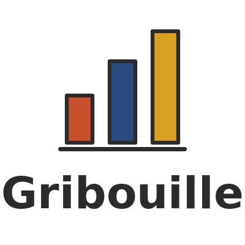

# Gribouille <picture><source media="(prefers-color-scheme: dark)" srcset="docs/assets/images/logo-stacked-dark.svg"><source media="(prefers-color-scheme: light)" srcset="docs/assets/images/logo-stacked.svg"></picture>

A layered grammar of graphics for Typst.

_Gribouille_ is French for "scribble".
The library implements Wilkinson's grammar of graphics in a declarative API for Typst documents, inspired by [`ggplot2`](https://ggplot2.tidyverse.org) (R) and [`plotnine`](https://plotnine.org) (Python).

Documentation: <https://m.canouil.dev/gribouille>.

> [!WARNING]
> _Gribouille_ is in active development.

## Quick look

```typst
#import "@preview/gribouille:0.0.1": *

#let df = csv("penguins.csv", row-type: dictionary)

#plot(
  data: penguins,
  mapping: aes(
    x: "flipper-len",
    y: "body-mass",
    colour: "species",
    shape: "species",
  ),
  layers: (
    geom-point(size: 2pt, stroke: 0.5pt, alpha: 0.5),
    geom-smooth(method: "lm", se: true, alpha: 0.2),
  ),
  scales: (
    scale-x-continuous(),
    scale-y-continuous(),
    scale-colour-discrete(palette: (rgb("#ff8c00"), rgb("#800080"), rgb("#008B8B"))),
  ),
  labs: labs(
    title: "Penguins Dataset",
    subtitle: "Flipper length vs body mass by species",
    caption: "Data from Palmer Archipelago (Antarctica) penguin dataset",
    colour: "Species",
    x: "Flipper length (mm)",
    y: "Body mass (g)",
  ),
  theme: theme-minimal(),
  width: 11cm,
  height: 7cm,
)
```

## Dependencies

See [`typst.toml`](typst.toml) and [`src/deps.typ`](src/deps.typ) for the authoritative Typst compiler and CeTZ versions.

## License

This project is licensed under the MIT License.
See the [LICENSE](LICENSE) file for details.
